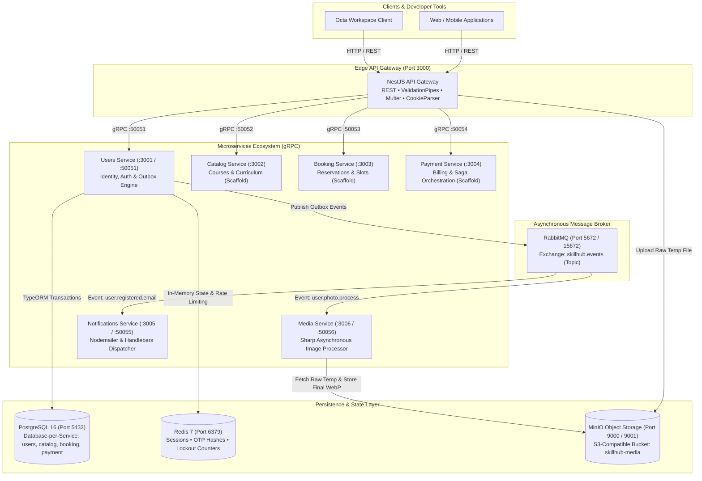

# 🚀 SkillUp (SkillHub) — Cloud-Native Microservices Platform

**SkillUp** is an enterprise-grade, high-performance educational platform architected as a distributed microservices system inside an **Nx Monorepo** powered by **NestJS** and **TypeScript**. Designed from the ground up for extreme **scalability**, fault tolerance, and hardened security, the platform adheres to modern distributed systems design principles including **gRPC inter-service communication**, **Event-Driven Architecture (EDA)**, **Transactional Outbox Pattern**, and **Database-per-Service**.

---

## 📑 Table of Contents
1. [System Architecture](#1-system-architecture)
2. [Microservices & Infrastructure Inventory](#2-microservices--infrastructure-inventory)
3. [Architectural Design Patterns](#3-architectural-design-patterns)
4. [Security & Abuse Prevention Architecture](#4-security--abuse-prevention-architecture)
5. [API Reference (Implemented Endpoints)](#5-api-reference-implemented-endpoints)
6. [Roadmap & Implementation Progress](#6-roadmap--implementation-progress)
7. [Local Setup & Deployment](#7-local-setup--deployment)
8. [Developer Tooling: Octa Workspace](#8-developer-tooling-octa-workspace)

---

## 1. System Architecture

The system decouples edge networking, core business logic, asynchronous background tasks, and high-speed in-memory state:
- **API Gateway:** The single entrypoint handling edge HTTP/REST traffic, cookie management, file upload streaming, request validation, and internal gRPC routing.
- **Internal Services:** Inter-service communication is powered by **gRPC over HTTP/2 with Protocol Buffers**, minimizing network serialization overhead and latency.
- **Asynchronous Event Pipeline:** Long-running, compute-heavy, and network I/O operations (image cropping/resizing and email dispatch) are completely decoupled through **RabbitMQ** and the **Transactional Outbox Pattern**.
- **In-Memory Cache & Session Layer:** **Redis** handles ephemeral state: cryptographic OTP hashes, rate limiters, abuse prevention locks, and active multi-device sessions.



---

## 2. Microservices & Infrastructure Inventory

### A. Application Services
| Service | Stack & Protocols | Responsibilities | Current Status |
| :--- | :--- | :--- | :---: |
| **API Gateway** | NestJS, Express, Multer, gRPC Client | Public REST API, global exception filters, request validation, cookie parsing, file intake, gRPC client dispatch. | **Active & Production-Ready** |
| **Users Service** | NestJS, TypeORM, gRPC Server, Redis | User identity lifecycle, bcrypt hashing, dual-token generation, multi-device session management, Transactional Outbox engine. | **Active & Production-Ready** |
| **Media Service** | NestJS, Sharp, MinIO S3 SDK, RabbitMQ | Consumes photo events, crops/scales/rotates avatar images, optimizes to WebP format, stores to permanent S3 keys, cleans temporary files. | **Active & Production-Ready** |
| **Notifications Service** | NestJS, Nodemailer, Handlebars, RabbitMQ | Consumes email events, compiles Handlebars email templates, handles SMTP dispatch with retry logic. | **Active & Production-Ready** |
| **Catalog Service** | NestJS, gRPC | Educational course catalog, lessons, curriculum structure, search index. | Skeleton Scaffold |
| **Booking Service** | NestJS, gRPC | Course seat reservations, schedule locks, concurrency control. | Skeleton Scaffold |
| **Payment Service** | NestJS, gRPC | Payment gateways, transaction outbox, distributed Saga compensation. | Skeleton Scaffold |

### B. Backing Infrastructure
- **PostgreSQL 16 (Alpine):** Isolated databases per service: `skillhub_users`, `skillhub_catalog`, `skillhub_booking`, `skillhub_payment`.
- **Redis 7 (Alpine):** In-memory session hashes, token revocation, OTP cryptographic hashes, rate limiting, and 15-minute lockouts.
- **RabbitMQ 3 (Management Alpine):** Reliable AMQP topic exchange (`skillhub.events`) with durable queues and acknowledgments.
- **MinIO Object Storage:** Self-hosted S3-compatible storage cluster with public read policy for published media and private access for temporary uploads.

---

## 3. Architectural Design Patterns

### 1. Transactional Outbox Pattern
* **The Problem:** In distributed architectures, updating a relational database and publishing an event to a message broker within the same execution cycle creates a dual-write problem. If the message broker is unreachable, the event is lost.
* **The Solution:** The user entity and the event payload are written atomically to `users` and `outbox_messages` tables inside a single database transaction (`queryRunner`).
* A background `OutboxWorker` reads pending messages, publishes them to RabbitMQ, and marks them as `PUBLISHED` only after acknowledgment, guaranteeing **At-Least-Once Delivery**.

### 2. Deterministic Storage & Asynchronous Media Pipeline
* The client uploads the raw avatar image to the API Gateway.
* The API Gateway stores the raw buffer in MinIO under a temporary staging key: `temp_uploads/{uuid}.ext`.
* The final destination key is generated deterministically before processing: `profile_photos/{userId}/avatar.webp`.
* This deterministic key is saved immediately into the `users` table. The asynchronous `media-service` picks up the event, processes the image using libvips/Sharp (cropping, scaling, WebP conversion), writes directly to the final key, and deletes the temporary file.

### 3. Distributed Multi-Device Session Management
* Active sessions are tracked inside Redis Hash structures: `session:{sessionId}` containing:
  - `userId`
  - `hashedRefreshToken` (SHA-256)
  - `ipAddress`
  - `userAgent`
  - `createdAt`
* Every user maintains a **Redis Sorted Set** (`user_sessions:{userId}`) storing timestamps as scores.
* The system enforces a strict **maximum of 5 active devices/sessions** per user. When a 6th session is registered, the oldest session is automatically purged from Redis.

---

## 4. Security & Abuse Prevention Architecture

### A. Cryptographic OTP Verification
- OTP codes are generated using cryptographically secure random integers (`crypto.randomInt(100000, 1000000)`).
- The OTP is stored in Redis **hashed with SHA-256** under `otp:verify:{email}`. Plaintext codes are never stored in cache memory.
- Standard validity window: **10 minutes (600 seconds)**.

### B. Brute-Force Lockout Guard (7 Attempts / 15-Minute Freeze)
- Max allowed failed verification attempts: **7 attempts**.
- On every invalid submission, the remaining attempts are returned:
  > *"Invalid verification code. You have X attempts remaining."*
- Upon reaching 7 consecutive failures:
  1. The OTP code is immediately invalidated and purged from Redis.
  2. The account is locked for **15 minutes (900 seconds)** under `rate:verify:{email}`.
  3. The API responds with `HTTP 429 Too Many Requests` including a `Retry-After: 900` response header.
- **Dual-Path Lockout Enforcement:** A locked account is prevented from bypassing the lockout via the resend endpoint. Both `/verify-account` and `/send-verification-code` strictly enforce the 15-minute freeze window.

### C. 60-Second Cooldown Guard (Email Flooding Prevention)
- Enforced via `cooldown:verify:{email}` in Redis with a **60-second TTL**.
- Activated upon user registration and refreshed on every code resend.
- Prevents malicious automated scripts or users from spamming verification emails.
- If invoked before expiry, the endpoint rejects the call with `HTTP 429 Too Many Requests` and a dynamic `Retry-After` header.

### D. Dual-Token Authentication Security
- **Access Token:** Short-lived JWT (15 minutes expiry) containing `sub`, `email`, `role`, and `sessionId`.
- **Refresh Token:** Cryptographically secure 32-byte hex string, hashed with SHA-256 in Redis.
- Transported exclusively inside an **HttpOnly Cookie**:
  - `httpOnly: true` (Shields token against Cross-Site Scripting / XSS).
  - `sameSite: 'lax'` (Mitigates Cross-Site Request Forgery / CSRF).
  - `path: '/api/v1/users/auth'` (Scoped strictly to authentication endpoints).
  - `maxAge: 7 days`.

---

## 5. API Reference (Implemented Endpoints)

Base URL: `http://localhost:3000/api/v1`

### 1. User Registration
* **Endpoint:** `POST /users/auth/register`
* **Content-Type:** `multipart/form-data`
* **Request Fields:**
  - `username` *(string, required)*: Unique user handle.
  - `email` *(string, required)*: Valid email address.
  - `password` *(string, required)*: User password.
  - `birthDate` *(string, optional)*: Birthdate string.
  - `avatar` *(file, optional)*: Image file (Max 5MB).
  - `crop_x`, `crop_y`, `crop_width`, `crop_height` *(numbers, required if avatar is present)*: Crop coordinates.
* **Success Response (201 Created):**
```json
{
  "success": true,
  "message": "User registered successfully",
  "userId": "97e283f5-7484-48f8-b3d6-444dd1a5f60b"
}
```

---

### 2. Account Verification & Auto-Login
* **Endpoint:** `POST /users/auth/verify-account`
* **Content-Type:** `application/json`
* **Request Body:**
```json
{
  "email": "user@example.com",
  "code": "437334"
}
```
* **Success Response (200 OK):**
```json
{
  "success": true,
  "message": "Account verified and logged in successfully",
  "data": {
    "accessToken": "eyJhbGciOiJIUzI1NiIsInR5cCI6IkpXVCJ9...",
    "user": {
      "id": "97e283f5-7484-48f8-b3d6-444dd1a5f60b",
      "email": "user@example.com",
      "username": "moaz",
      "role": "STUDENT",
      "status": "ACTIVE",
      "profilePhoto": "profile_photos/97e283f5-7484-48f8-b3d6-444dd1a5f60b/avatar.webp"
    }
  }
}
```
* **Set-Cookie Header:** Automatically attaches the secure `refreshToken` cookie (7 days expiry).

---

### 3. Resend Verification Code
* **Endpoint:** `POST /users/auth/send-verification-code`
* **Content-Type:** `application/json`
* **Request Body:**
```json
{
  "email": "user@example.com"
}
```
* **Success Response (200 OK):**
```json
{
  "success": true,
  "message": "A new verification code has been sent to your email address."
}
```
* **Rate-Limited Response (429 Too Many Requests):**
```json
{
  "success": false,
  "statusCode": 429,
  "message": "Please wait 45 seconds before requesting a new verification code.",
  "error": "Too Many Requests",
  "retryAfter": 45
}
```

---

## 6. Roadmap & Implementation Progress

| Feature / Milestone | Service Scope | Status |
| :--- | :--- | :---: |
| **User Registration + Avatar Crop** | Gateway + Users + Media + RabbitMQ | ✅ Completed |
| **Account Verification + Auto-Login** | Gateway + Users + Redis | ✅ Completed |
| **Resend Code + Cooldown + Lockout** | Gateway + Users + Notifications | ✅ Completed |
| **Login Endpoint (`/users/auth/login`)** | Bcrypt validation, Redis session issuance, dual tokens | ⏳ **Next Milestone** |
| **Token Refresh (`/users/auth/refresh`)** | Cookie parsing, token rotation, Redis session renewal | ⏳ Upcoming |
| **Logout Endpoint (`/users/auth/logout`)** | Session purge, cookie clearance, token blacklisting | ⏳ Upcoming |
| **Profile Management (`/users/me`)** | User profile retrieval and patch updates | ⏳ Upcoming |
| **Password Management** | Change password & forgot password recovery | ⏳ Upcoming |
| **Catalog, Booking & Payment Services** | Courses, reservations, and distributed Saga transactions | ⏳ Upcoming |

---

## 7. Local Setup & Deployment

### Start Backing Infrastructure (Docker):
```bash
docker compose up -d postgres redis rabbitmq minio
```

### Build & Run Microservices via Docker Compose:
```bash
docker compose up -d --build api-gateway users-service media-service notifications-service
```

### Run Microservices Locally via Nx (Development Mode):
```bash
npm run start:api-gateway
npm run start:users
npm run start:media
npm run start:notifications
```

---

## 8. Developer Tooling: Octa Workspace

The repository is integrated with **Octa** (all-in-one developer workspace) via [`skillUP.octa`](./skillUP.octa):
- Collection: **Skillup HUB -> Users-service**
- Pre-configured HTTP requests:
  1. `Register new user`: Multipart form with Base64 avatar and crop coordinates.
  2. `verify-account`: OTP verification request.
  3. `send-verification-code`: Resend OTP with cooldown and lockout validation.
- Auto-configured environment variables (`{{baseURL}}`) for zero-friction testing.
