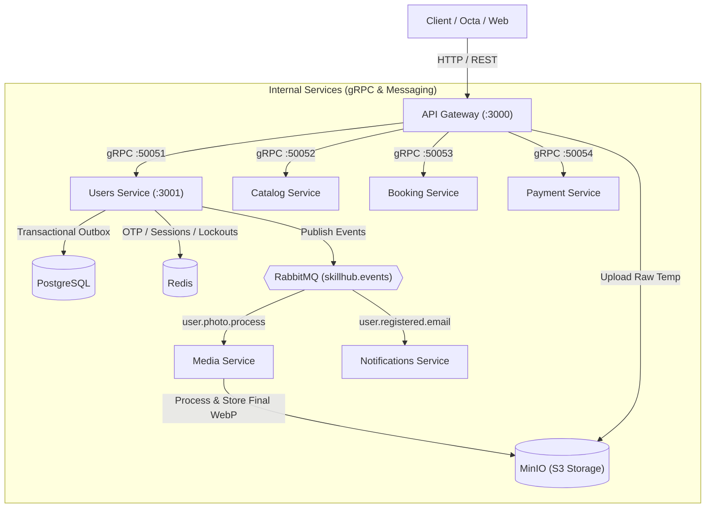

# 🚀 منصة SkillUp (SkillHub) - التوثيق المعماري والتقني الشامل

منصة **SkillUp** هي معمارية خدمات مصغرة متطورة (**Microservices Architecture**) مبنية باستخدام **NestJS** و **TypeScript** داخل **Nx Monorepo**. صُممت المنصة لتكون قابلة للتوسع العالي (**Scalable**)، فائقة الأداء، وعالية الأمان (**Enterprise-Grade Security**)، معتمدة على أفضل الممارسات الهندسية للأنظمة الموزعة (**Distributed Systems**).

---

## 📑 فهرس المحتويات
1. [نظرة عامة على المعمارية (System Architecture)](#1-نظرة-عامة-على-المعمارية-system-architecture)
2. [الخدمات المصغرة والبنية التحتية (Services & Infrastructure)](#2-الخدمات-المصغرة-والبنية-التحتية-services--infrastructure)
3. [الأنماط الهندسية المعتمدة (Design Patterns)](#3-الأنماط-الهندسية-المعتمدة-design-patterns)
4. [منظومة الأمان والحماية (Security & Rate Limiting)](#4-منظومة-الأمان-والحماية-security--rate-limiting)
5. [توثيق نقاط النهاية (API Endpoints Reference)](#5-توثيق-نقاط-النهاية-api-endpoints-reference)
6. [خارطة الطريق الحالية (Roadmap & Next Steps)](#6-خارطة-الطريق-الحالية-roadmap--next-steps)
7. [التشغيل والبيئة المحلية (Running & Infrastructure)](#7-التشغيل-والبيئة-المحلية-running--infrastructure)
8. [بيئة الاختبار وتطبيق Octa (Testing & Workspace)](#8-بيئة-الاختبار-وتطبيق-octa-testing--workspace)

---

## 1. نظرة عامة على المعمارية (System Architecture)

تعتمد المنصة على فصل المسؤوليات بالكامل:
- **API Gateway:** بوابة موحدة تواجه العميل عبر بروتوكول HTTP/REST وتدير المصادقة الأولية والـ Routing.
- **Internal Microservices:** تواصل داخلي فائق السرعة عبر **gRPC** (HTTP/2 + Protocol Buffers).
- **Asynchronous Event-Driven Pipeline:** معالجة غير متزامنة عبر **RabbitMQ** و **Transactional Outbox Pattern** للمهام الثقيلة (الوسائط والبريد).
- **High-Performance In-Memory Cache:** ذاكرة سريعة عبر **Redis** لإدارة الجلسات، التوكنات، حدود المحاولات، ومؤقتات التهدئة.



---

## 2. الخدمات المصغرة والبنية التحتية (Services & Infrastructure)

### أ. الخدمات البرمجية (Application Services)
| الخدمة | التقنيات والبروتوكول | الدور الوظيفي | الحالة الحالية |
| :--- | :--- | :--- | :---: |
| **API Gateway** | NestJS, Express, Multer, gRPC Client | استقبال طلبات الـ HTTP، التحقق من المدخلات (Pipes)، رفع الملفات المؤقتة، إدارة الـ Cookies، وتوجيه الطلبات عبر gRPC. | مكتملة ومحدثة |
| **Users Service** | NestJS, TypeORM, gRPC Server, Redis | إدارة دورة حياة المستخدمين، الأمان والتحقق، تشفير كلمات المرور، تتبع الجلسات المتعددة، ونمط Outbox. | مكتملة ومحدثة |
| **Media Service** | NestJS, Sharp, MinIO S3 SDK, RabbitMQ | معالجة الصور وقصها (Crop/Rotate/Scale) وتحويلها إلى WebP وحفظها في المسارات النهائية وحذف الملفات المؤقتة. | مكتملة ومحدثة |
| **Notifications Service**| NestJS, Nodemailer, Handlebars, RabbitMQ | استهلاك أحداث البريد وإرسال إيميلات التفعيل وتعيين كلمة المرور بقوالب HTML احترافية. | مكتملة ومحدثة |
| **Catalog Service** | NestJS, gRPC | إدارة الكورسات، المسارات، والمحتوى التعليمي. | هيكل أولي (Scaffold) |
| **Booking Service** | NestJS, gRPC | إدارة حجز المقاعد والمواعيد. | هيكل أولي (Scaffold) |
| **Payment Service** | NestJS, gRPC | إدارة المعاملات المالية وبوابات الدفع. | هيكل أولي (Scaffold) |

### ب. البنية التحتية (Backing Infrastructure)
- **PostgreSQL 16 (Alpine):** قاعدة بيانات معزولة لكل نطاق عمل (`skillhub_users`, `skillhub_catalog`, `skillhub_booking`, `skillhub_payment`).
- **Redis 7 (Alpine):** إدارة الجلسات، التوكنات، حدود الـ Rate Limiting، ومؤقتات الحظر.
- **RabbitMQ 3 (Management):** وسيط الرسائل الموزعة باستخدام Topic Exchange (`skillhub.events`).
- **MinIO Object Storage:** بديل محلي متوافق بنسبة 100% مع AWS S3 لحفظ الوسائط داخل الباكت `skillhub-media`.

---

## 3. الأنماط الهندسية المعتمدة (Design Patterns)

### 1. نمط صندوق الصادر المالي/المعاملاتي (Transactional Outbox Pattern)
* **المشكلة:** عند تسجيل مستخدم جديد، إذا تم حفظه في قاعدة البيانات ثم فشل خادم الـ RabbitMQ، يفقد النظام إشعار التفعيل ومعالجة الصورة.
* **الحل:** يتم إدراج الحدث في جدول `outbox_messages` داخل نفس معاملة قاعدة البيانات (`Database Transaction`) مع إنشاء المستخدم.
* يقوم الـ `OutboxWorker` بقراءة الرسائل المعلّقة ونشرها إلى RabbitMQ وتحديث حالتها إلى `PUBLISHED`، مما يضمن موثوقية التوصيل (**At-Least-Once Delivery**).

### 2. نمط التخزين الحتمي المسبق (Deterministic Storage Pattern)
* العميل يرفع الصورة الخام إلى الـ Gateway.
* ترفع الـ Gateway الصورة إلى مسار مؤقت: `temp_uploads/{uuid}.ext`.
* يُحدد مسار الصورة النهائي مسبقاً قبل المعالجة: `profile_photos/{userId}/avatar.webp`.
* يُسجل المسار النهائي فوراً في قاعدة بيانات المستخدمين، وتتولى `media-service` في الخلفية سحب الملف المؤقت وقصه وحفظه في المسار النهائي وحذف المؤقت.

### 3. إدارة الجلسات وتعدد الأجهزة (Multi-Device Session Management)
* تخزين جلسات المستخدمين في Redis Hash (`session:{sessionId}`) يتضمن:
  - معرّف المستخدم `userId`
  - نسخة مشفرة من Refresh Token (`hashedRefreshToken`)
  - عنوان IP ونوع المتصفح/الجهاز (`userAgent`)
* استخدام **Redis Sorted Set** (`user_sessions:{userId}`) لتسجيل تاريخ كل جلسة.
* تطبيق سقف أقصى **5 أجهزة نشطة** لكل مستخدم، ومسح الجلسة الأقدم تلقائياً عند تسجيل الدخول من جهاز سادس.

---

## 4. منظومة الأمان والحماية (Security & Rate Limiting)

تم تطبيق أقوى تدابير الأمان الهندسية على مستوى دورة المصادقة:

### أ. حماية كود التحقق (OTP Security)
- توليد كود عشوائي مشفر مكون من 6 أرقام باستخدام `crypto.randomInt`.
- تخزين الكود في Redis **بصيغة مشفرة عبر SHA-256** تحت المفتاح `otp:verify:{email}` لضمان عدم قراءة الكود الخام حتى لو تم الاطلاع على محتويات الذاكرة.
- مدة صلاحية الكود: **10 دقائق (600 ثانية)**.

### ب. نظام مكافحة التخمين والحظر الصارم (Brute Force & 15-Minute Lockout)
- حد أقصى **7 محاولات فاشلة** لإدخال الكود.
- في كل محاولة خاطئة، يتم إبلاغ المستخدم بعدد المحاولات المتبقية:
  > *"Invalid verification code. You have X attempts remaining."*
- عند الوصول للمحاولة السابعة الفاشلة:
  1. يُحذف كود الـ OTP فوراً من Redis لحرقه أمنياً.
  2. يُقفل الحساب مؤقتاً لمدة **15 دقيقة (900 ثانية)** عبر المفتاح `rate:verify:{email}`.
  3. يرجع السيرفر كود `HTTP 429 Too Many Requests` مع Header `Retry-After: 900`.
- **الحظر الصارم الثنائي:** لا يمكن للمستخدم الالتفاف على الحظر أو طلب كود جديد عبر زر Resend أثناء فترة الـ 15 دقيقة؛ فكلا المسارين (`verify-account` و `send-verification-code`) يفرضان نفس الحظر.

### ج. مؤقت التهدئة لإعادة الإرسال (Cooldown Timer - 60s)
- مفتاح `cooldown:verify:{email}` في Redis بمدة **60 ثانية**.
- يُفعّل فور تسجيل الحساب لأول مرة، وعند كل ضغطة على زر إعادة الإرسال (Resend).
- يمنع هجمات إغراق البريد الإلكتروني (Email Flooding / Denial of Wallet).
- إذا حاول المستخدم الطلب قبل انقضاء الـ 60 ثانية، يستلم `HTTP 429` مع Header `Retry-After` بالثواني المتبقية.

### د. حماية التوكنات (Dual-Token Security)
- **Access Token:** JWT موقع بـ `JWT_SECRET` مدته **15 دقيقة** فقط.
- **Refresh Token:** سلسلة عشوائية آمنة من 32 بايت، مشفرة داخل Redis بـ SHA-256.
- يتم إرسال Refresh Token حصرياً داخل **HttpOnly Cookie** مع خيارات:
  - `httpOnly: true` (حماية تامة من هجمات XSS).
  - `sameSite: 'lax'` (حماية من هجمات CSRF).
  - `path: '/api/v1/users/auth'` (محصورة فقط بنقاط نهاية المصادقة).
  - `maxAge: 7 أيام`.

---

## 5. توثيق نقاط النهاية (API Endpoints Reference)

الرابط الأساسي: `http://localhost:3000/api/v1`

### 1. تسجيل مستخدم جديد (Register)
* **المسار:** `POST /users/auth/register`
* **نوع المحتوى:** `multipart/form-data`
* **الحقول:**
  - `username` (string, required): اسم المستخدم
  - `email` (string, required): البريد الإلكتروني
  - `password` (string, required): كلمة المرور
  - `birthDate` (string, optional): تاريخ الميلاد
  - `avatar` (file, optional): ملف الصورة (بحد أقصى 5MB)
  - `crop_x`, `crop_y`, `crop_width`, `crop_height` (number, مطلوبة فقط عند رفع صورة): إحداثيات القص
* **الاستجابة الناجحة (201 Created):**
```json
{
  "success": true,
  "message": "User registered successfully",
  "userId": "97e283f5-7484-48f8-b3d6-444dd1a5f60b"
}
```

---

### 2. تفعيل الحساب وتسجيل الدخول التلقائي (Verify Account)
* **المسار:** `POST /users/auth/verify-account`
* **نوع المحتوى:** `application/json`
* **المدخلات:**
```json
{
  "email": "user@example.com",
  "code": "123456"
}
```
* **الاستجابة الناجحة (200 OK):**
```json
{
  "success": true,
  "message": "Account verified and logged in successfully",
  "data": {
    "accessToken": "eyJhbGciOiJIUzI1NiIsInR5cCI6IkpXVCJ9...",
    "user": {
      "id": "97e283f5-7484-48f8-b3d6-444dd1a5f60b",
      "email": "user@example.com",
      "username": "moaz",
      "role": "STUDENT",
      "status": "ACTIVE",
      "profilePhoto": "profile_photos/.../avatar.webp"
    }
  }
}
```
* **ملحوظة:** يتم إرفاق الـ `refreshToken` تلقائياً داخل الـ `Set-Cookie` Header.

---

### 3. إعادة إرسال كود التفعيل (Resend Verification Code)
* **المسار:** `POST /users/auth/send-verification-code`
* **نوع المحتوى:** `application/json`
* **المدخلات:**
```json
{
  "email": "user@example.com"
}
```
* **الاستجابة الناجحة (200 OK):**
```json
{
  "success": true,
  "message": "A new verification code has been sent to your email address."
}
```
* **استجابة تجاوز التهدئة أو الحظر (429 Too Many Requests):**
```json
{
  "statusCode": 429,
  "message": "Please wait 45 seconds before requesting a new verification code.",
  "error": "Too Many Requests",
  "retryAfter": 45
}
```

---

## 6. خارطة الطريق الحالية (Roadmap & Next Steps)

| الخاصية / المسار | النطاق | الحالة التقنية |
| :--- | :--- | :---: |
| **User Registration + Avatar Crop** | API Gateway + Users + Media + RabbitMQ | ✅ منجز بنجاح |
| **Verify Account + Auto-Login** | API Gateway + Users + Redis | ✅ منجز بنجاح |
| **Resend Code + Cooldown + Lockout**| API Gateway + Users + Notifications | ✅ منجز بنجاح |
| **Login Endpoint (`/users/auth/login`)** | فحص كلمة المرور بـ Bcrypt وإصدار الجلسة والتوكنات | ⏳ **الخطوة التالية مباشرة** |
| **Refresh Token (`/users/auth/refresh`)** | قراءة الكوكيز وتدوير الـ Refresh Token | ⏳ قادم |
| **Logout (`/users/auth/logout`)** | إبطال الجلسة ومسح الكوكيز والـ Blacklist | ⏳ قادم |
| **Profile (`GET & PATCH /users/me`)** | استرجاع وتحديث البروفايل والأفاتار | ⏳ قادم |
| **Password Management** | تغيير كلمة المرور واستعادتها عبر الإيميل | ⏳ قادم |
| **Catalog, Booking & Payment Services** | بناء الكورسات والحجوزات والدفع الموزع | ⏳ قادم |

---

## 7. التشغيل والبيئة المحلية (Running & Infrastructure)

### تشغيل خدمات البنية التحتية (Docker):
```bash
docker compose up -d postgres redis rabbitmq minio
```

### تشغيل الخدمات مع إعادة البناء (Build & Run Microservices):
```bash
docker compose up -d --build api-gateway users-service media-service notifications-service
```

### تشغيل الخدمات محلياً عبر Nx (Development Mode):
```bash
npm run start:api-gateway
npm run start:users
npm run start:media
npm run start:notifications
```

---

## 8. بيئة الاختبار وتطبيق Octa (Testing & Workspace)

تم ضبط وربط المشروع مع ملف مساحة العمل الخاص بتطبيق **Octa** في مسار المشروع:
- ملف الإعدادات: [`skillUP.octa`](./skillUP.octa)
- يتضمن المجموعة الكاملة **Skillup HUB** -> **Users-service**:
  1. `Register new user`: طلب تسجيل متكامل مع صورة مشفرة Base64 وإحداثيات القص.
  2. `verify-account`: طلب التحقق بكود الـ 6 أرقام.
  3. `send-verification-code`: طلب إعادة إرسال الكود مع فحص الـ Cooldown والـ Lockout.
  4. متغيرات البيئة `{{baseURL}}` مهيأة تلقائياً لاختبار السيرفر بسهولة وسرعة.
